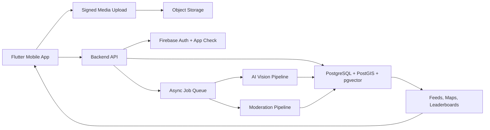

# Architecture Plan

## Architecture Thesis

PakimonGO should be a server-authoritative mobile system. The app captures evidence and displays experiences; backend services decide trust, scoring, visibility, moderation, and leaderboard effects.

## High-Level System

## Client App

Use Flutter for Android-first delivery and future iOS support.

Client responsibilities:

- Authentication UI.
- Camera capture.
- Foreground location capture.
- Upload progress.
- Map display.
- Feed, profile, group, and collection UI.
- Local drafts and retry queue.

Client must not:

- Assign final score.
- Trust device location blindly.
- Write leaderboard values directly.
- Expose raw secrets.
- Publish exact public coordinates by default.

## Backend Services

Use a modular backend with clear service boundaries:

- Identity adapter: verifies Firebase tokens and account state.
- Submission service: creates capture records and signed uploads.
- Media service: processes images, thumbnails, EXIF policy, and storage paths.
- Evidence service: computes hashes, embeddings, metadata, and AI evidence.
- Scoring service: applies versioned scoring rules.
- Geo service: handles PostGIS regions, map cells, zoo/captive geofences, and local leaderboards.
- Social service: posts, captions, comments, likes, reposts, groups, and hashtags.
- Leaderboard service: server-side score events and rankings.
- Moderation service: reports, blocks, review queues, takedowns, and appeals.
- Notification service: friend invites, owner tags, comments, score results.

## Evidence Pipeline

Submission flow:

1. Client requests signed upload.
2. Client uploads original image.
3. Backend creates immutable `submission`.
4. Async job strips unsafe public metadata and generates derivatives.
5. Backend computes SHA-256, normalized hash, crop hashes, quality metrics, and embeddings.
6. Backend checks geofence/zoo/captive context.
7. Backend runs AI vision structured extraction.
8. Backend cross-checks labels, taxonomy, location, duplicate edges, and abuse signals.
9. Backend writes versioned score events.
10. Backend publishes post or routes to moderation/review.

## Database Direction

Use PostgreSQL as canonical state:

- Relational integrity for users, posts, groups, comments, reports, scores.
- PostGIS for capture coordinates, map cells, local leaderboards, and geofences.
- pgvector for image/crop embeddings and similarity search.
- Audit tables for AI runs, prompt versions, model versions, score formulas, and moderation actions.

Use object storage for media:

- Originals are private.
- Thumbnails and approved derivatives can be public/CDN-backed.
- Storage paths are immutable.
- Metadata controls visibility, owner, moderation state, and retention.

## Map Direction

Default to Mapbox for a game-like map prototype. Re-evaluate if Google routing/Places/POI quality becomes dominant.

Important rule: do not casually mix Google Places/Routes content into a non-Google map. Validate provider terms before combining map content.

Map data should use:

- Private exact capture coordinates.
- Public H3/geohash/cell clusters.
- Delayed or blurred public locations.
- Viewport-bounded queries.
- Server-generated clusters or vector tiles for scale.

## Zoo And Captive Detection

Use layered detection:

- Curated geofences for zoos, aquariums, petting zoos, safari parks, sanctuaries, and exhibits.
- OSM-derived zoo/captive venue data imported into the backend.
- Optional provider-specific POI checks only if license-compatible.
- PostGIS `ST_DWithin` buffers using GPS accuracy.
- User self-disclosure.
- AI evidence such as cages, signage, indoor exhibit context, leash/collar, and human handling.

Output should be `wild_eligible`, `zoo_likely`, `pet_likely`, `captive_uncertain`, or `needs_review`; not a single brittle boolean.

## Duplicate Detection

Use layered matching:

- Exact duplicate hash.
- Normalized image hash.
- Perceptual hash on image and animal crop.
- Crop embedding similarity with pgvector.
- Same user/device/time/location/species windows.
- Web repost detection where available.

Store `duplicate_edges` and encounter groups. Do not delete blindly. Let users replace a photo with a better shot without farming score.

## Scoring Architecture

Use versioned score events, not mutable score blobs.

Candidate components:

- Animal present confidence.
- Species confidence.
- Regional rarity.
- Novelty and duplicate status.
- Safety/respectful distance estimate.
- Image quality.
- Aesthetic/artistic score.
- Name/caption effort.
- Pet owner tag credit.
- Social engagement, capped and fraud-damped.
- Honesty bonus for zoo disclosure.
- Diminishing returns for repetition.
- Catch-up multiplier for new/low-score users.

Keep scientific/wild score separate from social popularity and pet/cute score.

## Architecture Decision Records

Major choices must be tracked in `docs/adr/`. Each ADR should include:

- Decision
- Status
- Context
- Options
- Internal challenge
- Decision
- Consequences
- Reversal conditions
