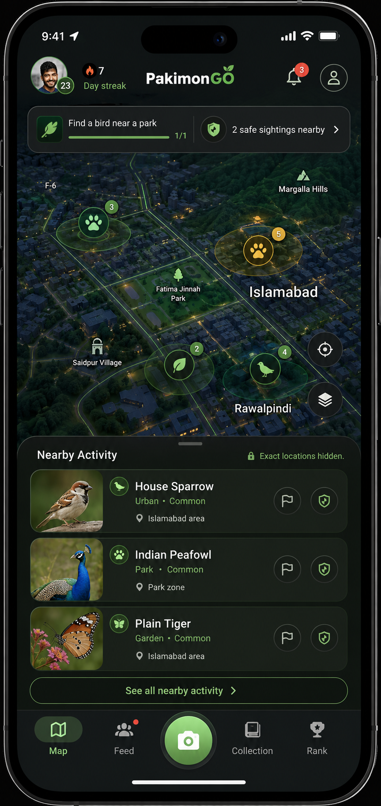
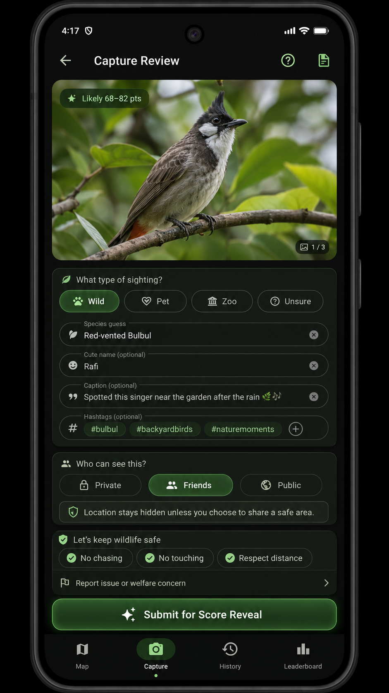
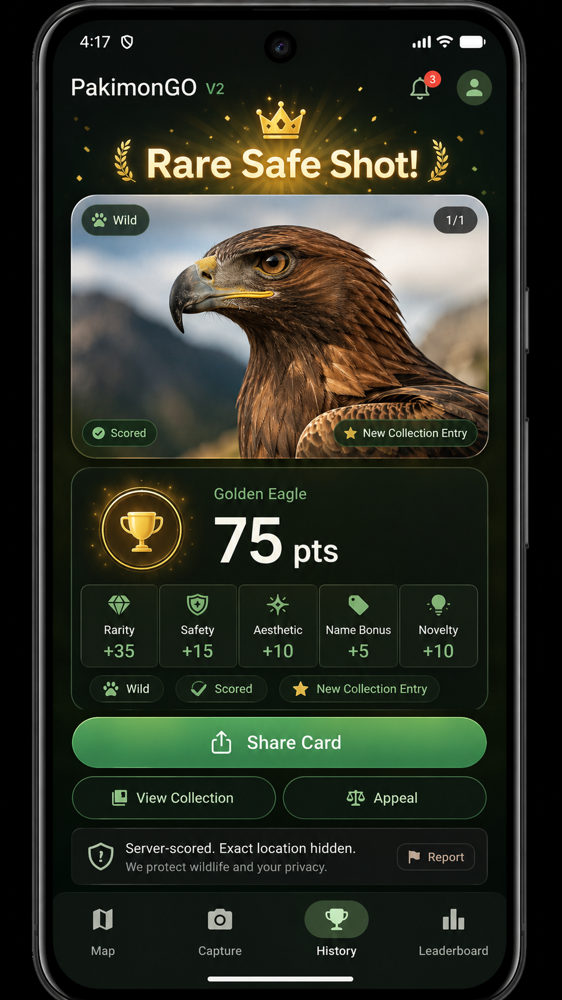
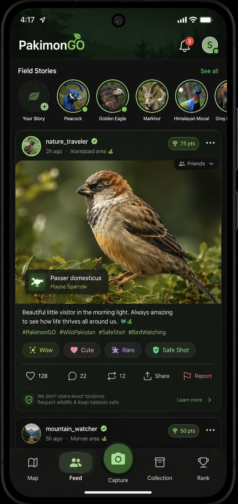
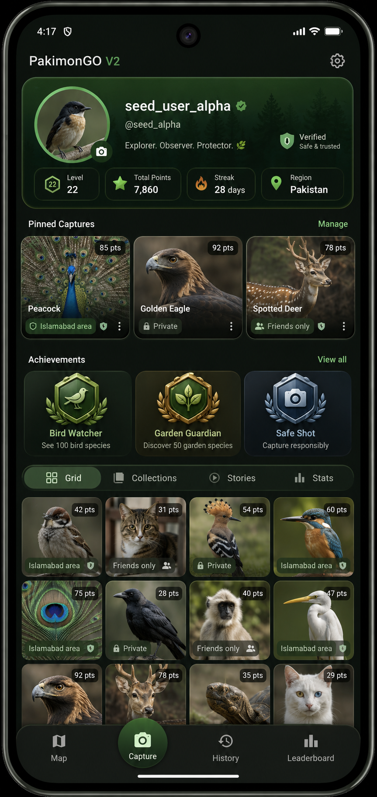
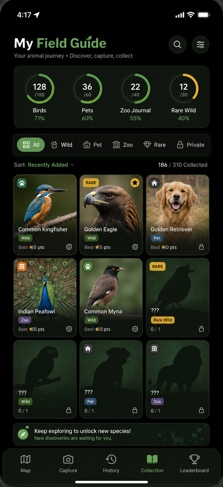
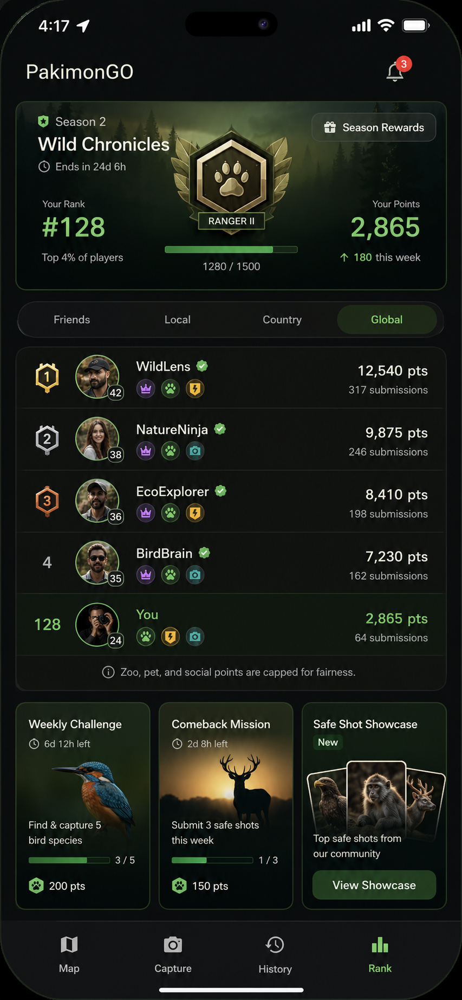
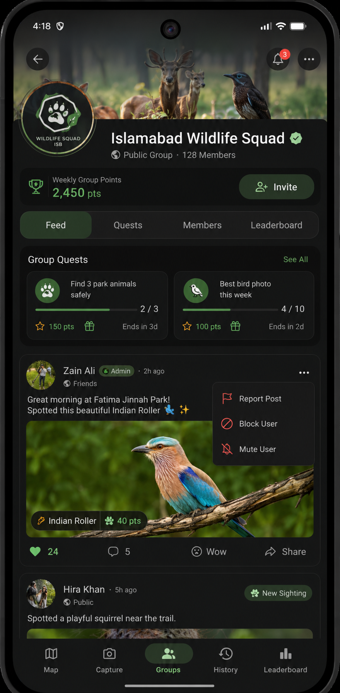
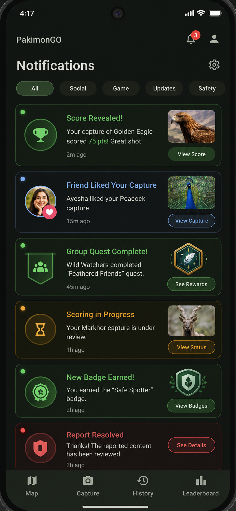
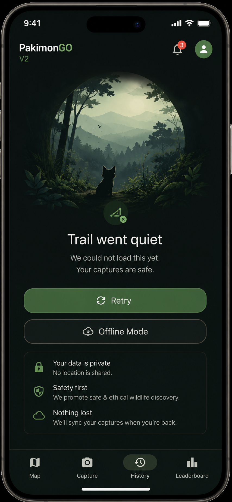

# PakimonGO V2 UI Concept Panels

## Purpose

This folder stores the 10 downloaded V2 concept panels generated from the V2
UI prompts. The files were renamed from UUID download names into stable,
numbered panel names so future design work can reference them consistently.

These are concept images, not implementation specs. Use them to decide the V2
visual direction, then promote approved details into requirements, wireframes,
and Flutter work packages.

The companion hardcoded HTML/CSS prototype lives at
`docs/prototypes/v2-ui-html/index.html`.

## Panel Index

| # | File | Panel | Role |
|---|---|---|---|
| 01 | `01-v2-map-home.png` | V2 Map Home | Main game-world screen and north-star visual direction. |
| 02 | `02-v2-capture-review.png` | Capture Review | Photo-first submit flow before score reveal. |
| 03 | `03-v2-score-reveal.png` | Score Reveal | Reward moment after server scoring. |
| 04 | `04-v2-social-feed.png` | Social Feed | Instagram/Facebook-like wildlife feed. |
| 05 | `05-v2-player-profile.png` | Player Profile | Player identity, captures, badges, and social presence. |
| 06 | `06-v2-field-guide-collection.png` | Field Guide Collection | Collectible species-card album. |
| 07 | `07-v2-rank-hub.png` | Rank Hub | Seasonal competition and leaderboard hub. |
| 08 | `08-v2-group-page.png` | Group Page | Friend squad / nature club surface. |
| 09 | `09-v2-notifications.png` | Notifications | Rich game/social activity inbox. |
| 10 | `10-v2-empty-error-state.png` | Empty/Error State | Premium failure/offline state. |

## 01 - V2 Map Home

This is the strongest V2 north-star panel. It turns the V1 map into a true game
world: a dark, 3D, street-level city/terrain map with glowing privacy-safe
animal activity circles, habitat markers, and clear nearby activity.

Key UI details:

- Top HUD shows avatar, level, streak, centered PakimonGO branding,
  notification badge, and profile button.
- Mission strip combines a quest (`Find a bird near a park`) with progress and
  `2 safe sightings nearby`.
- Map markers are not exact pins; they are large activity zones with count
  badges.
- Nearby Activity bottom sheet shows animal thumbnails, species names, habitat
  context, broad area labels, and safe action icons.
- Large central capture button remains the main action.
- Bottom navigation uses V2 shell: Map, Feed, Capture, Collection, Rank.

Design takeaways for implementation:

- Keep Map as the V2 home screen.
- Replace V1's plain title area with a game HUD.
- Make privacy visible through `Exact locations hidden` language.
- Use bottom sheets over the map instead of separate static marker lists.

## 02 - Capture Review

This panel solves the biggest V1 capture issue: V1 was form-first, while V2 is
photo-first. The animal image dominates the screen, then the user confirms
context, species, name, caption, hashtags, visibility, and safety.

Key UI details:

- Large photo preview with likely score range and image count.
- Context chips for Wild, Pet, Zoo, and Unsure.
- Guided fields for species guess, cute name, caption, and hashtags.
- Visibility section with Private, Friends, Public.
- Location privacy reassurance before submit.
- Wildlife safety checklist: No chasing, No touching, Respect distance.
- Strong green `Submit for Score Reveal` action.

Design takeaways for implementation:

- Move capture from flat form to guided card flow.
- Show disabled-submit reasons clearly.
- Keep privacy and safety copy in the flow, not hidden in settings.
- Make `Friends` or `Private` feel like normal defaults, not second-class modes.

## 03 - Score Reveal

This panel defines the emotional reward moment V1 does not yet have. The score
is presented like a premium game result card while still explaining that it is
server-scored and privacy-safe.

Key UI details:

- Celebration header: `Rare Safe Shot!`.
- Large hero animal photo with Wild, Scored, and New Collection Entry chips.
- Species and total points are prominent.
- Score breakdown tiles: Rarity, Safety, Aesthetic, Name Bonus, Novelty.
- Actions: Share Card, View Collection, Appeal.
- Trust footer: `Server-scored. Exact location hidden.`
- Report button remains visible for safety/moderation.

Design takeaways for implementation:

- Add a dedicated score reveal route after scoring completes.
- Keep score explanation readable and celebratory.
- Let users share the result card without sharing exact location.
- Make appeal/report a normal control, not an error path.

## 04 - Social Feed

This panel adapts Instagram-style photo social patterns to PakimonGO. It has
Field Stories, a large photo card, reactions, comments, repost/share, report,
score chips, privacy labels, and location safety language.

Key UI details:

- Field Stories row with circular animal thumbnails.
- Main feed card uses a large wildlife photo and creator identity.
- Score chip (`75 pts`) and visibility dropdown (`Friends`) are prominent.
- Species overlay card identifies the capture.
- Caption and hashtags support social browsing.
- Reactions are wildlife-specific: Wow, Cute, Rare, Safe Shot.
- Standard social controls: like, comment, repost, share, report.
- Footer reminds users exact locations are not shared.

Design takeaways for implementation:

- Feed cards should be photo-first and privacy-labeled.
- Use wildlife-specific reactions rather than generic only.
- Report should be visible but not visually dominant.
- Field Stories can be a later-gated feature; do not require it for first V2.

## 05 - Player Profile

This panel converts V1 Profile from a settings page into a player identity page.
It gives the user a sense of level, points, streak, region, pinned captures,
achievements, tabs, and a profile grid.

Key UI details:

- Hero profile card with avatar, verified badge, username, handle, short motto,
  trust badge, level, total points, streak, and region.
- Pinned captures show photo, species, score, visibility, and overflow menus.
- Achievement cards create long-term identity goals.
- Tabs: Grid, Collections, Stories, Stats.
- Grid has score chips and privacy labels.
- Capture remains prominent in bottom navigation.

Design takeaways for implementation:

- Move settings behind a gear icon.
- First viewport should show identity and progress, not form controls.
- Make pinned captures and badges central to social motivation.
- Keep per-post visibility visible in profile grids.

## 06 - Field Guide Collection

This panel turns Collection into a collectible field-guide album. It uses
progress rings, filters, species cards, rarity labels, privacy icons, and locked
silhouette cards for missing discoveries.

Key UI details:

- Header: `My Field Guide`.
- Progress rings for Birds, Pets, Zoo Journal, and Rare Wild.
- Filter bar: All, Wild, Pet, Zoo, Rare, Private.
- Sort label and collection progress count.
- Species cards include image, name, context chip, best score, rarity, and
  privacy/region icons.
- Locked silhouette cards make missing animals feel collectible.
- Bottom callout encourages continued exploration.

Design takeaways for implementation:

- Replace list-only collection with card/grid mode.
- Support category progress and missing-species silhouettes.
- Separate wild, pet, zoo, rare, and private collection meanings.
- Collection should be both progress tracker and social showcase.

## 07 - Rank Hub

This panel makes leaderboard feel seasonal and game-like. It adds rank class,
progress, leaderboard scopes, badges, weekly challenges, comeback missions, and
showcases.

Key UI details:

- Season card: `Wild Chronicles`, time remaining, rank, points, progress.
- Rank badge: `Ranger II`.
- Scope tabs: Friends, Local, Country, Global.
- Leaderboard rows include avatars, levels, badge chips, points, and submissions.
- Current user row is highlighted.
- Fairness note says zoo, pet, and social points are capped.
- Bottom cards: Weekly Challenge, Comeback Mission, Safe Shot Showcase.

Design takeaways for implementation:

- Add season framing before building more leaderboard scopes.
- Give users near-term missions even if they are far from global top ranks.
- Show fairness/capped-score messaging in Rank.
- Preserve separate ledgers so social points do not dominate wild discovery.

## 08 - Group Page

This panel shows how PakimonGO can become social through safer private/group
spaces before broad public social exposure. It combines Facebook Groups, Strava
clubs, and wildlife quests.

Key UI details:

- Hero group image and badge for `Islamabad Wildlife Squad`.
- Public group label, member count, weekly group points, invite action.
- Tabs: Feed, Quests, Members, Leaderboard.
- Group quest cards with progress, points, rewards, and end timers.
- Group feed post with admin label, visibility label, animal photo, score chip,
  reactions, comments, wow, and share.
- Overflow menu includes Report Post, Block User, Mute User.

Design takeaways for implementation:

- Groups are a strong V2 bridge between private play and public social.
- Start with invite/private groups before full public discovery feed.
- Quest cards and group leaderboard can drive retention without unsafe map
  precision.
- Moderation controls must be present from the first group UI.

## 09 - Notifications

This panel upgrades V1 notifications from plain rows into a rich activity inbox
with categories, thumbnails, actions, and severity colors.

Key UI details:

- Category chips: All, Social, Game, Updates, Safety.
- Cards for Score Revealed, Friend Liked Your Capture, Group Quest Complete,
  Scoring in Progress, New Badge Earned, and Report Resolved.
- Each card has iconography, thumbnail or badge art, message, timestamp, and
  action button.
- Color system: green for rewards, blue for social, amber for pending, red for
  moderation/safety.
- Settings gear is available.

Design takeaways for implementation:

- Notifications should become an activity center, not just alerts.
- Categorization helps scale social/game messages.
- Include direct action buttons to reduce navigation friction.
- Keep safety/moderation messages visually distinct.

## 10 - Empty/Error State

This panel gives V2 a premium fallback state. It replaces the V1 generic error
screen with an atmospheric but still functional design.

Key UI details:

- Branded top area with PakimonGO V2, notification badge, and profile icon.
- Large forest/animal illustration creates emotional continuity.
- Friendly title: `Trail went quiet`.
- Reassuring copy: captures are safe.
- Primary Retry button and secondary Offline Mode button.
- Trust panel explains data privacy, safety-first behavior, and sync recovery.
- Bottom nav remains available.

Design takeaways for implementation:

- Empty/error states should still feel like PakimonGO.
- Use friendly recovery actions, not only an error message.
- Offline reassurance matters because capture can happen outdoors.
- Keep accessibility: clear text, strong contrast, obvious actions.

## Naming Map

Original downloaded files were renamed as follows:

| Original file | New file |
|---|---|
| `562a1567-f56c-4be2-a7e1-89a6d5a0986d.png` | `01-v2-map-home.png` |
| `9f46ac64-0802-4ae0-b125-d6d775e859f4.png` | `02-v2-capture-review.png` |
| `a58d30cc-db3f-48c4-983c-82e77071ee5a.png` | `03-v2-score-reveal.png` |
| `05baa50d-2a11-4778-b3d9-f8e704264ea1.png` | `04-v2-social-feed.png` |
| `7a5b8d88-f2b3-4439-babe-40fe4ede6271.png` | `05-v2-player-profile.png` |
| `627eac39-2ff7-4959-9c0f-4e55244b8551.png` | `06-v2-field-guide-collection.png` |
| `6ba9a87a-0c10-4fda-be00-9c486b090149.png` | `07-v2-rank-hub.png` |
| `38eaa430-1ca8-433e-8d9b-5652f51d7100.png` | `08-v2-group-page.png` |
| `f81f73cf-899b-4ac0-b139-e4c50ab02987.png` | `09-v2-notifications.png` |
| `c16dfbde-a42b-4af3-91b7-2444a7274ca3.png` | `10-v2-empty-error-state.png` |

## Next Design Decisions

Before implementation, decide:

- Which panels are V2 must-haves versus later inspiration.
- Whether bottom navigation should be `Map / Feed / Capture / Collection / Rank`
  or retain V1 labels until the backend supports Feed.
- Whether Groups is a primary tab, secondary Feed tab, or post-launch surface.
- Which UI details should be formalized into `docs/REQUIREMENTS.md`.
- Which text, icons, and cards need accessibility review before Flutter work.
