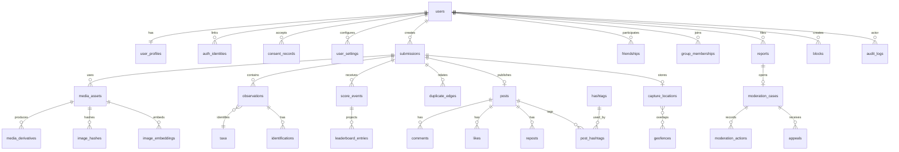

# Database ERD And Schema Plan

## Direction

PostgreSQL is the canonical product database. Use PostGIS for geospatial/geofence queries and pgvector for similarity search. Photos and derivatives live in object storage.

Detailed table guidance lives in `docs/data/DATA_DICTIONARY.md`.

## ERD

## Core Tables

| Area | Tables |
|---|---|
| Identity | `users`, `auth_identities`, `user_profiles`, `user_settings`, `consent_records`, `account_deletion_requests`, `data_export_requests` |
| Media | `media_assets`, `media_derivatives`, `media_processing_jobs`, `image_hashes`, `image_embeddings`, `animal_crops` |
| Submissions | `submissions`, `submission_attributes`, `observations`, `identifications`, `encounter_groups`, `duplicate_edges` |
| Animal Knowledge | `taxa`, `taxon_aliases`, `taxon_regions`, `taxonomy_imports`, `sensitive_taxon_rules`, `rarity_snapshots` |
| Geo | `capture_locations`, `public_location_cells`, `geofences`, `geofence_sources`, `local_regions`, `map_activity_snapshots` |
| Scoring | `score_formula_versions`, `score_events`, `score_totals`, `leaderboard_entries`, `leaderboard_snapshots`, `trust_events` |
| Social | `posts`, `post_visibility_rules`, `comments`, `likes`, `reposts`, `hashtags`, `post_hashtags`, `friendships`, `groups`, `group_memberships`, `blocks` |
| Moderation | `reports`, `moderation_cases`, `moderation_actions`, `appeals`, `policy_versions`, `evidence_access_grants` |
| Operations | `audit_logs`, `outbox_events`, `idempotency_keys`, `feature_flags`, `region_configs`, `provider_runs` |

## Restricted Data Classification

| Class | Examples | Storage Rule |
|---|---|---|
| Restricted | exact coordinates, originals, raw EXIF, auth ids, phone/email, private URLs | encrypted/restricted access, never public DTOs |
| Sensitive | embeddings, AI evidence, moderation cases, friend graph, score explanations | role-limited access and audit |
| Controlled Public | approved derivatives, public captions, display names | visibility and moderation filtered |
| Aggregate Public | map cells, leaderboard rows, species summaries | coarse, delayed, thresholded |
| Operational | logs, metrics, traces | no secrets, no exact coords, no raw private URLs |

## Index Plan

- B-tree: primary keys, foreign keys, owner ids, statuses, timestamps.
- Partial indexes: active public posts, pending moderation, pending scoring, visible leaderboard entries.
- GiST: geofence geometries, capture location geographies, public cells.
- pgvector: image and crop embeddings after benchmark validation.
- Composite: `(user_id, created_at)`, `(submission_id, created_at)`, `(scope, period, score)`, `(status, priority, created_at)`.

## Schema Rules

- Score history is append-only; never update old score events to correct scoring.
- Public map cells are derived records; exact location remains restricted.
- Deletion workflows must anonymize or detach eligible user data while retaining minimal audit exceptions.
- Outbox events are used for async worker reliability before broader Pub/Sub fan-out.
- Every moderation/admin/deletion action creates an audit log.
- Idempotency keys protect uploads, submissions, reports, blocks, likes, reposts, appeals, and deletion/export requests.
