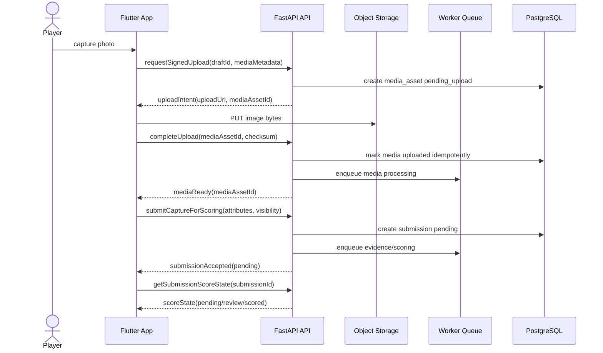

# API Sequence: Capture And Submit

```mermaid
sequenceDiagram
  actor Player
  participant App as Flutter App
  participant API as FastAPI API
  participant Store as Object Storage
  participant Worker as Worker Queue
  participant DB as PostgreSQL

  Player->>App: capture photo
  App->>API: requestSignedUpload(draftId, mediaMetadata)
  API->>DB: create media_asset pending_upload
  API-->>App: uploadIntent(uploadUrl, mediaAssetId)
  App->>Store: PUT image bytes
  App->>API: completeUpload(mediaAssetId, checksum)
  API->>DB: mark media uploaded idempotently
  API->>Worker: enqueue media processing
  API-->>App: mediaReady(mediaAssetId)
  App->>API: submitCaptureForScoring(attributes, visibility)
  API->>DB: create submission pending
  API->>Worker: enqueue evidence/scoring
  API-->>App: submissionAccepted(pending)
  App->>API: getSubmissionScoreState(submissionId)
  API-->>App: scoreState(pending/review/scored)
```
