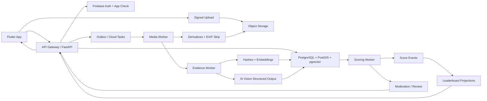

# Architecture Flow

```mermaid
flowchart LR
  A["Flutter App"] --> B["API Gateway / FastAPI"]
  A --> C["Signed Upload"]
  C --> D["Object Storage"]
  B --> E["Firebase Auth + App Check"]
  B --> F["PostgreSQL + PostGIS + pgvector"]
  B --> G["Outbox / Cloud Tasks"]
  G --> H["Media Worker"]
  H --> I["Derivatives + EXIF Strip"]
  I --> D
  H --> J["Evidence Worker"]
  J --> K["Hashes + Embeddings"]
  J --> L["AI Vision Structured Output"]
  K --> F
  L --> F
  F --> M["Scoring Worker"]
  M --> N["Score Events"]
  N --> O["Leaderboard Projections"]
  M --> P["Moderation / Review"]
  O --> B
  P --> B
  B --> A
```

## Notes

The flow keeps scoring async and auditable. AI evidence is one input, not the sole authority.
