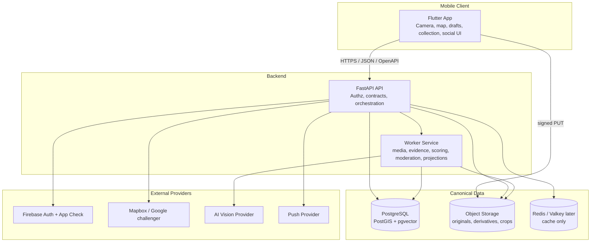

# C4 Container Diagram

```mermaid
flowchart TB
  subgraph Mobile["Mobile Client"]
    Flutter["Flutter App\nCamera, map, drafts, collection, social UI"]
  end

  subgraph Backend["Backend"]
    API["FastAPI API\nAuthz, contracts, orchestration"]
    Workers["Worker Service\nmedia, evidence, scoring, moderation, projections"]
  end

  subgraph Data["Canonical Data"]
    DB[("PostgreSQL\nPostGIS + pgvector")]
    ObjectStore[("Object Storage\noriginals, derivatives, crops")]
    Cache[("Redis / Valkey later\ncache only")]
  end

  subgraph Providers["External Providers"]
    Firebase["Firebase Auth + App Check"]
    Mapbox["Mapbox / Google challenger"]
    Vision["AI Vision Provider"]
    Notify["Push Provider"]
  end

  Flutter -->|"HTTPS / JSON / OpenAPI"| API
  Flutter -->|"signed PUT"| ObjectStore
  API --> Firebase
  API --> DB
  API --> ObjectStore
  API --> Cache
  API --> Workers
  Workers --> DB
  Workers --> ObjectStore
  Workers --> Vision
  API --> Mapbox
  API --> Notify
```

## Notes

The mobile client captures and displays. The backend owns trust, scoring, visibility, moderation, and leaderboard writes.
