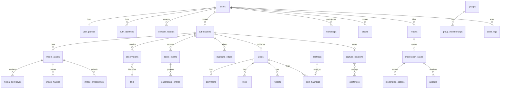

# Database ERD Diagram

```mermaid
erDiagram
  users ||--|| user_profiles : has
  users ||--o{ auth_identities : links
  users ||--o{ consent_records : accepts
  users ||--o{ submissions : creates
  users ||--o{ friendships : participates
  users ||--o{ blocks : creates
  users ||--o{ reports : files
  submissions ||--o{ media_assets : uses
  submissions ||--o{ observations : contains
  submissions ||--o{ score_events : receives
  submissions ||--o{ duplicate_edges : relates
  submissions ||--o| posts : publishes
  submissions ||--o| capture_locations : stores
  observations }o--|| taxa : identifies
  capture_locations }o--o{ geofences : overlaps
  media_assets ||--o{ media_derivatives : produces
  media_assets ||--o{ image_hashes : hashes
  media_assets ||--o{ image_embeddings : embeds
  score_events ||--o{ leaderboard_entries : projects
  posts ||--o{ comments : has
  posts ||--o{ likes : has
  posts ||--o{ reposts : has
  posts ||--o{ post_hashtags : tags
  hashtags ||--o{ post_hashtags : used_by
  groups ||--o{ group_memberships : has
  reports ||--o| moderation_cases : opens
  moderation_cases ||--o{ moderation_actions : records
  moderation_cases ||--o{ appeals : receives
  users ||--o{ audit_logs : actor
```

## Notes

This is a planning ERD. Final migrations must be generated only after database tooling is selected.
