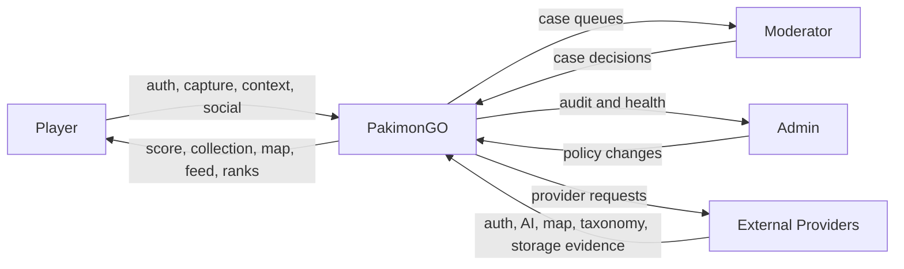
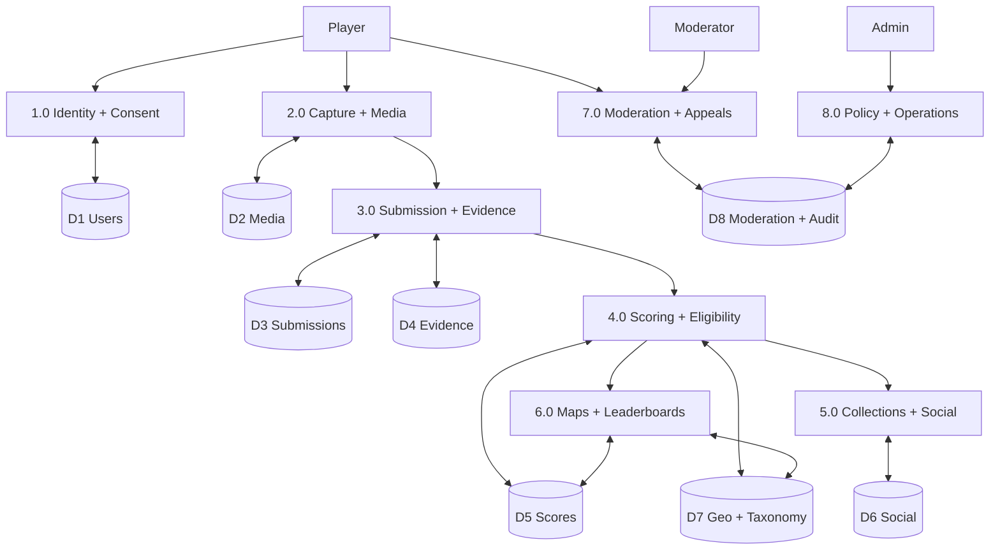
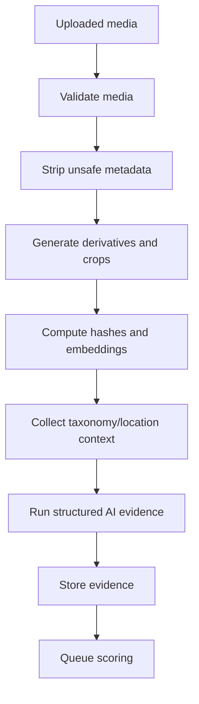
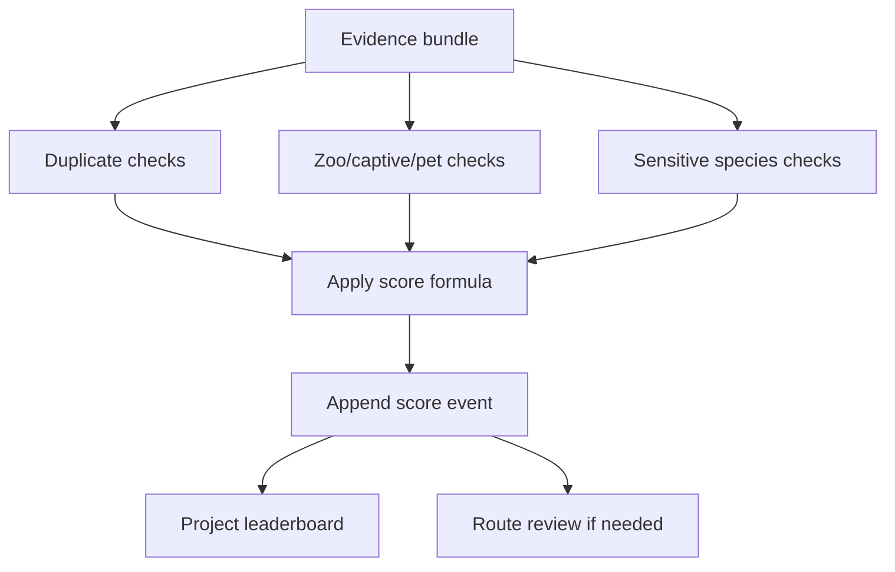

# Data Flow Diagrams

## Level 0

```mermaid
flowchart LR
  Player["Player"] -->|"auth, capture, context, social"| System["PakimonGO"]
  System -->|"score, collection, map, feed, ranks"| Player
  Moderator["Moderator"] -->|"case decisions"| System
  System -->|"case queues"| Moderator
  Admin["Admin"] -->|"policy changes"| System
  System -->|"audit and health"| Admin
  Providers["External Providers"] -->|"auth, AI, map, taxonomy, storage evidence"| System
  System -->|"provider requests"| Providers
```

## Level 1

```mermaid
flowchart TD
  P1["1.0 Identity + Consent"] <--> D1[("D1 Users")]
  P2["2.0 Capture + Media"] <--> D2[("D2 Media")]
  P3["3.0 Submission + Evidence"] <--> D3[("D3 Submissions")]
  P3 <--> D4[("D4 Evidence")]
  P4["4.0 Scoring + Eligibility"] <--> D5[("D5 Scores")]
  P4 <--> D7[("D7 Geo + Taxonomy")]
  P5["5.0 Collections + Social"] <--> D6[("D6 Social")]
  P6["6.0 Maps + Leaderboards"] <--> D5
  P6 <--> D7
  P7["7.0 Moderation + Appeals"] <--> D8[("D8 Moderation + Audit")]
  P8["8.0 Policy + Operations"] <--> D8

  Player["Player"] --> P1
  Player --> P2
  P2 --> P3
  P3 --> P4
  P4 --> P5
  P4 --> P6
  Player --> P7
  Moderator["Moderator"] --> P7
  Admin["Admin"] --> P8
```

## Level 2: Submission Evidence

```mermaid
flowchart TD
  A["Uploaded media"] --> B["Validate media"]
  B --> C["Strip unsafe metadata"]
  C --> D["Generate derivatives and crops"]
  D --> E["Compute hashes and embeddings"]
  E --> F["Collect taxonomy/location context"]
  F --> G["Run structured AI evidence"]
  G --> H["Store evidence"]
  H --> I["Queue scoring"]
```

## Level 2: Scoring Eligibility

```mermaid
flowchart TD
  A["Evidence bundle"] --> B["Duplicate checks"]
  A --> C["Zoo/captive/pet checks"]
  A --> D["Sensitive species checks"]
  B --> E["Apply score formula"]
  C --> E
  D --> E
  E --> F["Append score event"]
  F --> G["Project leaderboard"]
  F --> H["Route review if needed"]
```
