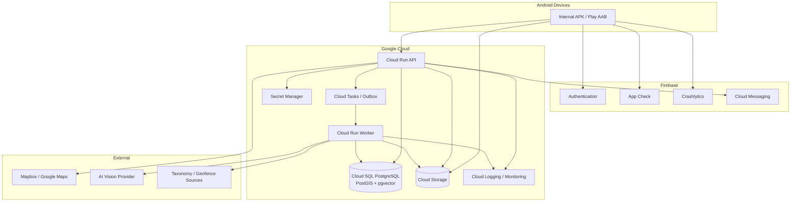

# Deployment View Diagram

```mermaid
flowchart TB
  subgraph Android["Android Devices"]
    APK["Internal APK / Play AAB"]
  end

  subgraph Firebase["Firebase"]
    FirebaseAuth["Authentication"]
    AppCheck["App Check"]
    Crashlytics["Crashlytics"]
    FCM["Cloud Messaging"]
  end

  subgraph GCP["Google Cloud"]
    CloudRunAPI["Cloud Run API"]
    CloudRunWorker["Cloud Run Worker"]
    CloudTasks["Cloud Tasks / Outbox"]
    CloudSQL[("Cloud SQL PostgreSQL\nPostGIS + pgvector")]
    GCS[("Cloud Storage")]
    SecretManager["Secret Manager"]
    Monitoring["Cloud Logging / Monitoring"]
  end

  subgraph Providers["External"]
    MapProvider["Mapbox / Google Maps"]
    AIProvider["AI Vision Provider"]
    TaxonomySource["Taxonomy / Geofence Sources"]
  end

  APK --> CloudRunAPI
  APK --> GCS
  APK --> FirebaseAuth
  APK --> AppCheck
  APK --> Crashlytics
  CloudRunAPI --> CloudSQL
  CloudRunAPI --> GCS
  CloudRunAPI --> CloudTasks
  CloudRunAPI --> SecretManager
  CloudTasks --> CloudRunWorker
  CloudRunWorker --> CloudSQL
  CloudRunWorker --> GCS
  CloudRunWorker --> AIProvider
  CloudRunAPI --> MapProvider
  CloudRunWorker --> TaxonomySource
  CloudRunAPI --> FCM
  CloudRunAPI --> Monitoring
  CloudRunWorker --> Monitoring
```

## Notes

Deployment is proposed for alpha planning. Final cloud setup depends on ADR acceptance and budget/region review.
