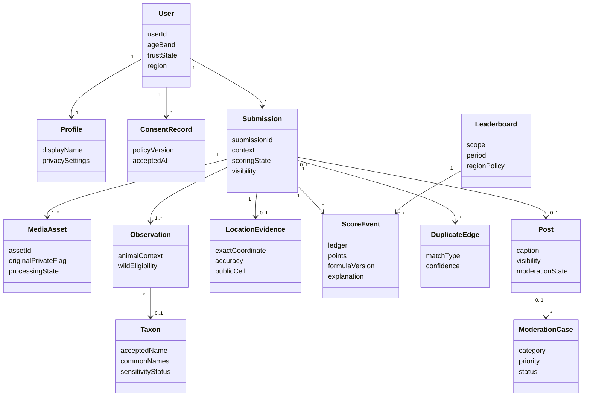

# Domain Model Diagram

```mermaid
classDiagram
  class User {
    userId
    ageBand
    trustState
    region
  }
  class Profile {
    displayName
    privacySettings
  }
  class ConsentRecord {
    policyVersion
    acceptedAt
  }
  class Submission {
    submissionId
    context
    scoringState
    visibility
  }
  class MediaAsset {
    assetId
    originalPrivateFlag
    processingState
  }
  class Observation {
    animalContext
    wildEligibility
  }
  class Taxon {
    acceptedName
    commonNames
    sensitivityStatus
  }
  class LocationEvidence {
    exactCoordinate
    accuracy
    publicCell
  }
  class ScoreEvent {
    ledger
    points
    formulaVersion
    explanation
  }
  class DuplicateEdge {
    matchType
    confidence
  }
  class Post {
    caption
    visibility
    moderationState
  }
  class ModerationCase {
    category
    priority
    status
  }
  class Leaderboard {
    scope
    period
    regionPolicy
  }

  User "1" --> "1" Profile
  User "1" --> "*" ConsentRecord
  User "1" --> "*" Submission
  Submission "1" --> "1..*" MediaAsset
  Submission "1" --> "1..*" Observation
  Observation "*" --> "0..1" Taxon
  Submission "1" --> "0..1" LocationEvidence
  Submission "1" --> "*" ScoreEvent
  Submission "1" --> "*" DuplicateEdge
  Submission "0..1" --> "0..1" Post
  Post "0..1" --> "*" ModerationCase
  Leaderboard "1" --> "*" ScoreEvent
```
