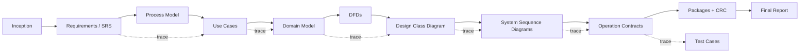

# Methodology Chain Diagram

```mermaid
flowchart LR
  A["Inception"] --> B["Requirements / SRS"]
  B --> C["Process Model"]
  C --> D["Use Cases"]
  D --> E["Domain Model"]
  E --> F["DFDs"]
  F --> G["Design Class Diagram"]
  G --> H["System Sequence Diagrams"]
  H --> I["Operation Contracts"]
  I --> J["Packages + CRC"]
  J --> K["Final Report"]

  B -.trace.-> D
  D -.trace.-> E
  E -.trace.-> G
  G -.trace.-> H
  H -.trace.-> I
  I -.trace.-> L["Test Cases"]
```

## Rule

Every feature must trace: requirement -> use case -> domain concept -> class/operation -> SSD -> contract -> test.
