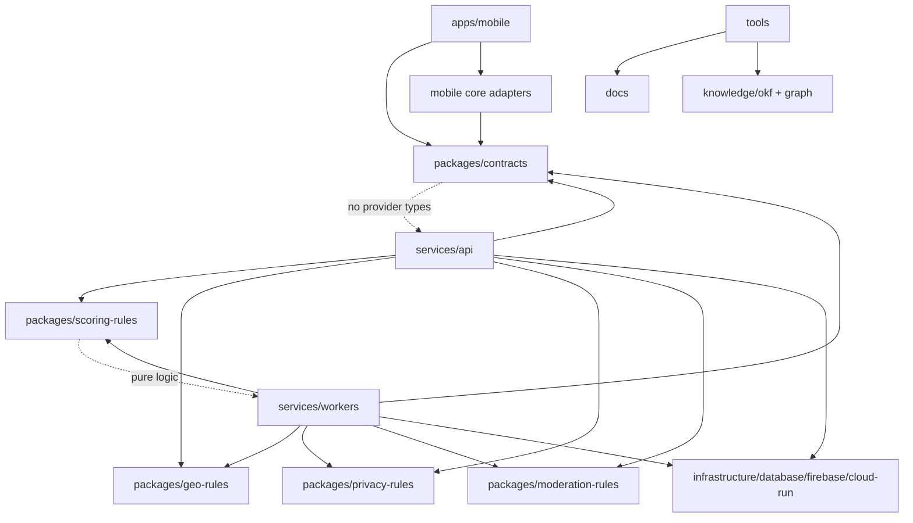

# Package Dependency Diagram

## Boundary Rules

- Mobile does not compute final score.
- API/domain does not expose provider SDK types.
- Public contracts do not include exact normal capture coordinates.
- Workers are idempotent and append score events rather than mutating history.
