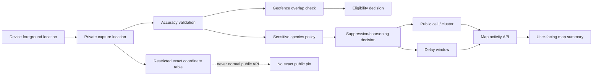

# Privacy Location Flow

## Public Output Rules

- Public APIs return cells/clusters, not exact normal capture coordinates.
- Sensitive species can be delayed, coarsened, hidden, or sent to review.
- Waypoints target general areas, not exact animal pins.
