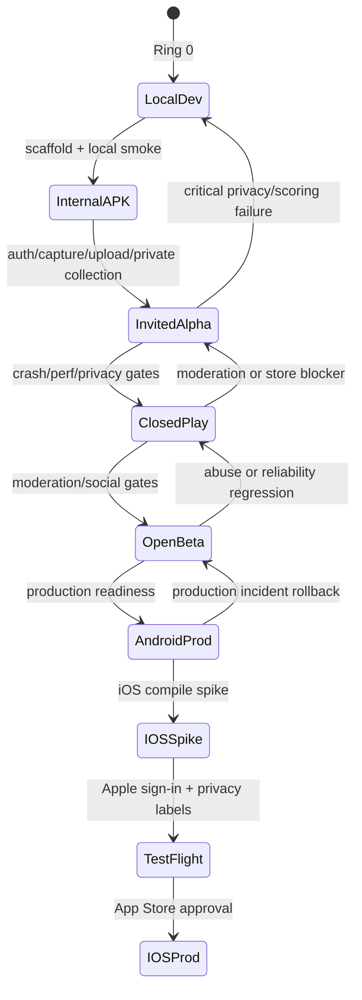

# Release Process Diagram

## Gates

- Alpha: no exact public location leaks, capture/upload/private collection work.
- Social: report, block, hide/delete, moderation, appeals, audit.
- Production: observability, runbooks, load tests, store disclosures, security review.
