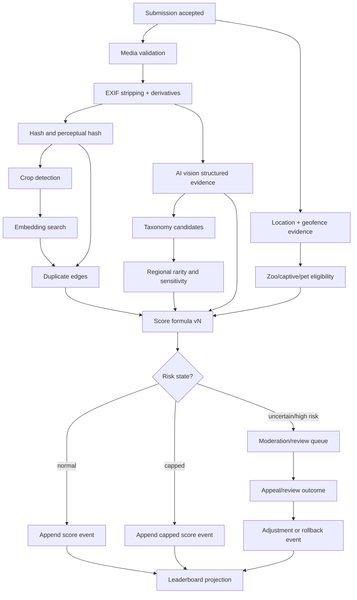

# Scoring Pipeline Diagram

```mermaid
flowchart TD
  A["Submission accepted"] --> B["Media validation"]
  B --> C["EXIF stripping + derivatives"]
  C --> D["Hash and perceptual hash"]
  D --> E["Crop detection"]
  E --> F["Embedding search"]
  C --> G["AI vision structured evidence"]
  G --> H["Taxonomy candidates"]
  H --> I["Regional rarity and sensitivity"]
  A --> J["Location + geofence evidence"]
  J --> K["Zoo/captive/pet eligibility"]
  D --> L["Duplicate edges"]
  F --> L
  I --> M["Score formula vN"]
  K --> M
  L --> M
  G --> M
  M --> N{"Risk state?"}
  N -->|"normal"| O["Append score event"]
  N -->|"capped"| P["Append capped score event"]
  N -->|"uncertain/high risk"| Q["Moderation/review queue"]
  O --> R["Leaderboard projection"]
  P --> R
  Q --> S["Appeal/review outcome"]
  S --> T["Adjustment or rollback event"]
  T --> R
```

## Core Rule

AI evidence informs scoring, but deterministic privacy, duplicate, zoo, safety, and audit rules constrain final score.
