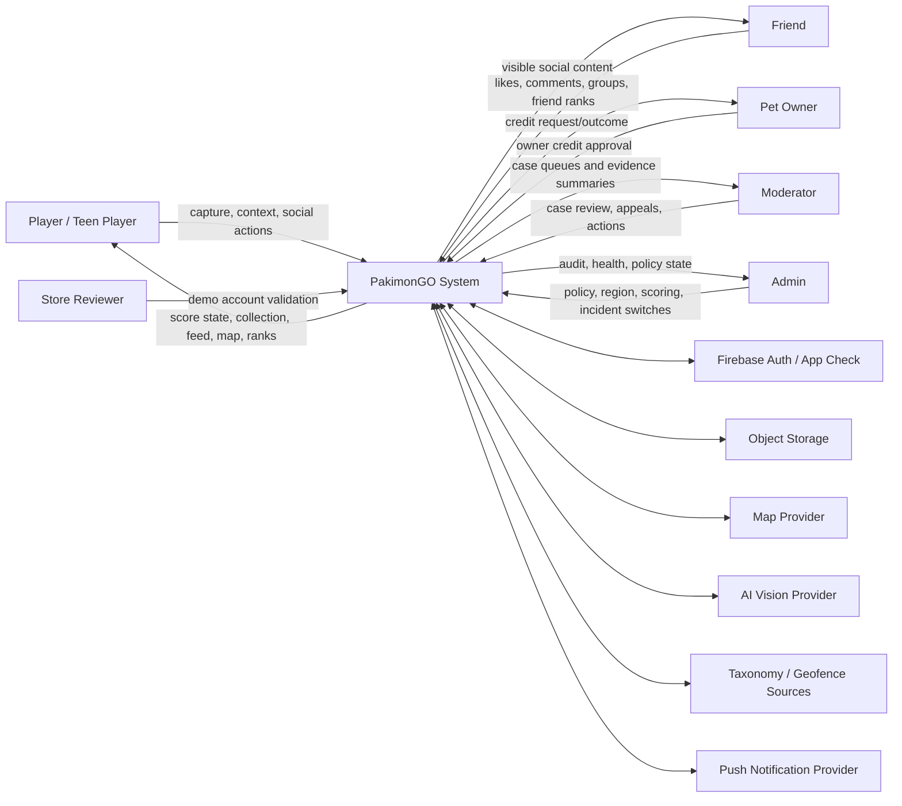

# System Context Diagram

## Notes

PakimonGO is the system boundary. External providers supply evidence or delivery capability, but PostgreSQL-backed backend state remains canonical product truth.
