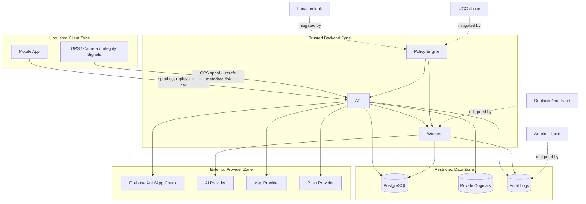

# Threat Model Diagram

## STRIDE Anchors

- Spoofing: auth, App Check, Play Integrity, risk signals.
- Tampering: server-authoritative scoring, idempotency, immutable score events.
- Repudiation: audit logs and trace IDs.
- Information disclosure: DTO tests, EXIF stripping, public cells.
- Denial of service: rate limits, queues, cost caps.
- Elevation of privilege: role checks and case-needed evidence.
