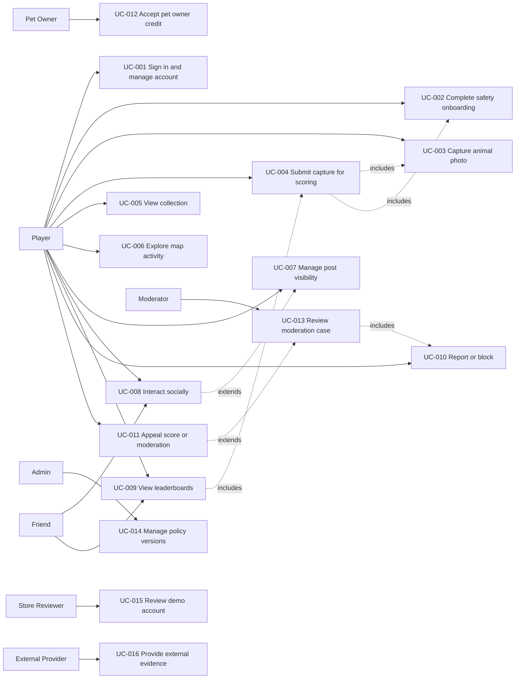

# Use Case Overview Diagram

```mermaid
flowchart LR
  Player["Player"] --> UC001["UC-001 Sign in and manage account"]
  Player --> UC002["UC-002 Complete safety onboarding"]
  Player --> UC003["UC-003 Capture animal photo"]
  Player --> UC004["UC-004 Submit capture for scoring"]
  Player --> UC005["UC-005 View collection"]
  Player --> UC006["UC-006 Explore map activity"]
  Player --> UC007["UC-007 Manage post visibility"]
  Player --> UC008["UC-008 Interact socially"]
  Player --> UC009["UC-009 View leaderboards"]
  Player --> UC010["UC-010 Report or block"]
  Player --> UC011["UC-011 Appeal score or moderation"]

  Friend["Friend"] --> UC008
  Friend --> UC009
  PetOwner["Pet Owner"] --> UC012["UC-012 Accept pet owner credit"]
  Moderator["Moderator"] --> UC013["UC-013 Review moderation case"]
  Admin["Admin"] --> UC014["UC-014 Manage policy versions"]
  StoreReviewer["Store Reviewer"] --> UC015["UC-015 Review demo account"]
  ExternalProvider["External Provider"] --> UC016["UC-016 Provide external evidence"]

  UC004 -.includes.-> UC003
  UC004 -.includes.-> UC002
  UC008 -.extends.-> UC007
  UC009 -.includes.-> UC004
  UC013 -.includes.-> UC010
  UC011 -.extends.-> UC013
```
