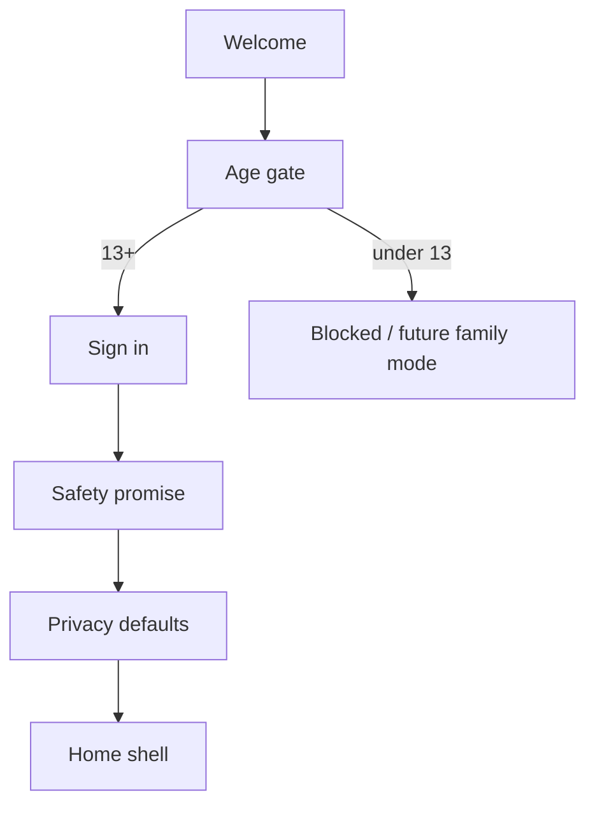
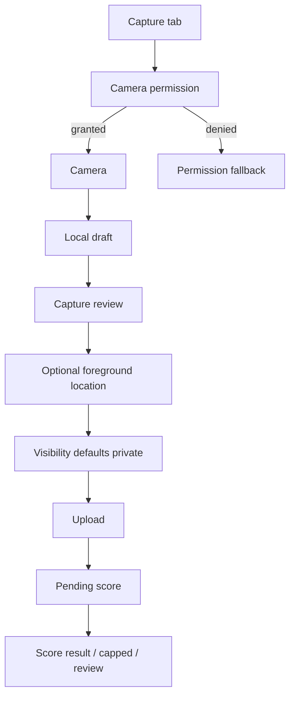
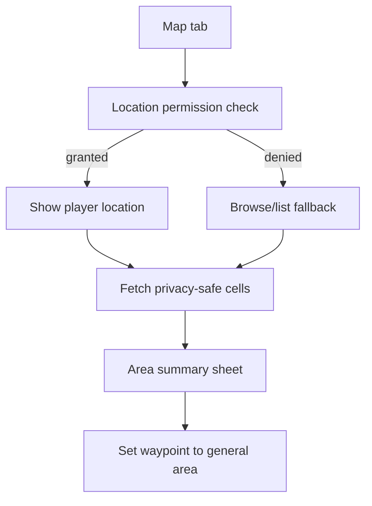
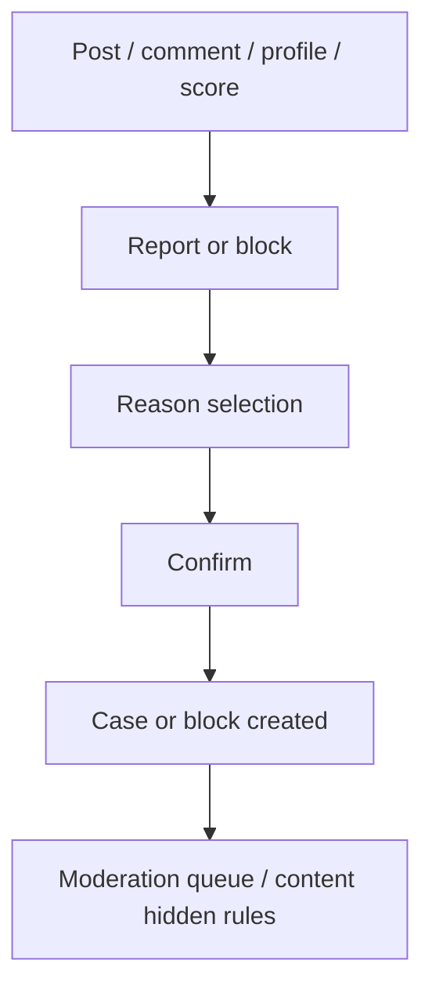

# UX Flow Diagrams

## First Launch

```mermaid
flowchart TD
  A["Welcome"] --> B["Age gate"]
  B -->|"13+"| C["Sign in"]
  B -->|"under 13"| D["Blocked / future family mode"]
  C --> E["Safety promise"]
  E --> F["Privacy defaults"]
  F --> G["Home shell"]
```

## Capture

```mermaid
flowchart TD
  A["Capture tab"] --> B["Camera permission"]
  B -->|"granted"| C["Camera"]
  B -->|"denied"| D["Permission fallback"]
  C --> E["Local draft"]
  E --> F["Capture review"]
  F --> G["Optional foreground location"]
  G --> H["Visibility defaults private"]
  H --> I["Upload"]
  I --> J["Pending score"]
  J --> K["Score result / capped / review"]
```

## Map

```mermaid
flowchart TD
  A["Map tab"] --> B["Location permission check"]
  B -->|"granted"| C["Show player location"]
  B -->|"denied"| D["Browse/list fallback"]
  C --> E["Fetch privacy-safe cells"]
  D --> E
  E --> F["Area summary sheet"]
  F --> G["Set waypoint to general area"]
```

## Report And Block

```mermaid
flowchart TD
  A["Post / comment / profile / score"] --> B["Report or block"]
  B --> C["Reason selection"]
  C --> D["Confirm"]
  D --> E["Case or block created"]
  E --> F["Moderation queue / content hidden rules"]
```
