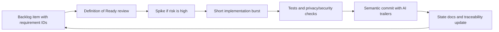

# 01 Software Process Model

## Candidate Survey

| Model | Fit For PakimonGO | Concern |
|---|---|---|
| Waterfall | Useful for final report assembly and regulated checklists. | Too rigid for AI/scoring/map/social uncertainty. |
| Incremental | Strong fit because Alpha-0 can be built as vertical slices. | Requires a stable architectural base. |
| Iterative | Strong fit because scoring, UX, and AI improve through feedback. | Needs strict traceability to avoid drift. |
| Spiral | Useful for high-risk privacy, AI, and moderation prototypes. | Too heavyweight as the everyday process. |
| Agile/Scrum | Strong fit for volatile details and frequent reprioritization. | Needs extra documentation discipline. |
| Prototyping | Strong for map, camera, AI scoring, duplicate, and zoo detection spikes. | Prototypes must not become ungoverned production code. |

## Selected Model

Use a hybrid Agile incremental process with risk-driven prototype gates.

PakimonGO has a stable product shape but high-risk implementation details: camera and map performance, zoo detection, duplicate matching, AI fairness, moderation load, location privacy, and store compliance. Agile increments let the team ship small verified slices; risk-driven prototypes stop dangerous assumptions from entering production.

## Development Loop

## Process Rules

- Every story references requirement IDs.
- Every high-risk story has privacy/security review notes.
- Every data-changing story has migration and rollback notes.
- Every AI/scoring story has benchmark or goldset coverage.
- Every social exposure story has moderation and abuse readiness gates.
- Every implementation task commits in short semantic bursts.

## Alternative Model And Trigger

Fallback: Spiral model for a subsystem.

Switch trigger: if a subsystem has repeated safety, privacy, AI fairness, cost, or legal failures across two consecutive iterations, pause feature delivery for that subsystem and run a spiral cycle: identify risk, prototype, evaluate, decide, then resume.

## Exit Criteria

- Process model is selected and justified.
- Fallback model and trigger are explicit.
- Process connects to `docs/PROCESS.md`, work packages, traceability, and commits.
