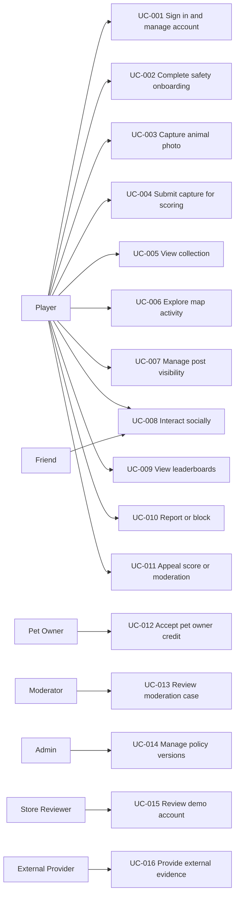

# 02 Use Cases

## Use Case Diagram

## High-Level Use Cases

| ID | Use Case | Primary Actor | Intent |
|---|---|---|---|
| UC-001 | Sign in and manage account | Player | Create, access, recover, export, or delete an account. |
| UC-002 | Complete safety onboarding | Player | Understand age, safety, privacy, scoring, and permission expectations. |
| UC-003 | Capture animal photo | Player | Take or prepare an animal photo as a local draft. |
| UC-004 | Submit capture for scoring | Player | Upload media and submit context for server scoring. |
| UC-005 | View collection | Player | See private or visible captured animals and score states. |
| UC-006 | Explore map activity | Player | View privacy-safe animal activity and set a waypoint. |
| UC-007 | Manage post visibility | Player | Choose private, friends, selected friends, or public visibility. |
| UC-008 | Interact socially | Player/Friend | Like, comment, repost, share, hashtag, join groups, and view feeds. |
| UC-009 | View leaderboards | Player | Compare scores globally, by country, locally, or with friends. |
| UC-010 | Report or block | Player | Reduce abuse and unwanted interaction. |
| UC-011 | Appeal score or moderation | Player | Challenge duplicate, zoo, identification, score, or moderation decisions. |
| UC-012 | Accept pet owner credit | Pet Owner | Approve shared credit for a pet photo. |
| UC-013 | Review moderation case | Moderator | Resolve reports, unsafe content, appeals, and suspicious score events. |
| UC-014 | Manage policy versions | Admin | Update scoring, geofence, taxonomy, sensitivity, or release policies. |
| UC-015 | Review demo account | Store Reviewer | Validate app behavior using safe demo data. |
| UC-016 | Provide external evidence | External Provider | Return auth, AI, map, taxonomy, or storage evidence to the system. |

## Expanded Use Case: UC-004 Submit Capture For Scoring

| Field | Detail |
|---|---|
| Scope / Level | PakimonGO system; user-goal level. |
| Primary Actor | Player |
| Stakeholders | Player wants fair surprise score; animals need safety; moderators need evidence; system needs anti-fraud integrity. |
| Preconditions | Player is signed in, age gate passed, local draft exists, required permissions or fallbacks are known. |
| Success Guarantees | Submission exists, media is uploaded or queued, exact location remains private, scoring state is pending or review. |
| Main Success Scenario | 1. Player opens capture review. 2. Player enters context, name, caption, tags, and visibility. 3. Player confirms submission. 4. System creates signed upload intent. 5. Player uploads media. 6. System marks upload complete. 7. System records submission. 8. System runs prechecks. 9. System queues scoring. 10. System returns pending score state. |
| Extensions | 3a. Missing required context: system asks for correction. 5a. Upload fails: system keeps draft and allows retry. 8a. Zoo/captive uncertainty: system caps or reviews. 8b. Duplicate suspected: system groups or caps and allows appeal. 9a. AI unavailable: system keeps pending/retry state. |
| Special Requirements | `FR-CAP-*`, `FR-SCORE-*`, `FR-DUP-*`, `FR-ZOO-*`, `NFR-SEC-*`, `NFR-PRIV-*`. |

## Expanded Use Case: UC-006 Explore Map Activity

| Field | Detail |
|---|---|
| Scope / Level | PakimonGO system; user-goal level. |
| Primary Actor | Player |
| Stakeholders | Player wants discovery; animals and people need location privacy; admins need provider-term compliance. |
| Preconditions | Map feature enabled in region; user granted location permission or chooses map-only browsing. |
| Success Guarantees | Map returns only privacy-safe cells/clusters, never normal exact capture coordinates. |
| Main Success Scenario | 1. Player opens map. 2. System requests viewport activity. 3. System applies region, privacy, sensitivity, delay, and visibility rules. 4. System returns clusters/cells. 5. Player selects area summary. 6. Player sets waypoint to a general area. |
| Extensions | 1a. No location permission: system shows browse/list fallback. 3a. Sensitive species: system suppresses or coarsens. 4a. Map provider outage: system uses cached/list view. |
| Special Requirements | `FR-MAP-*`, `FR-TAX-007`, `FR-LB-013`, `NFR-PRIV-*`, `NFR-PERF-003`. |

## Expanded Use Case: UC-013 Review Moderation Case

| Field | Detail |
|---|---|
| Scope / Level | PakimonGO moderator/admin system; user-goal level. |
| Primary Actor | Moderator |
| Stakeholders | Reporter wants safety; reported user wants fairness; system needs auditability and minimal evidence exposure. |
| Preconditions | Moderator has elevated access and a case exists. |
| Success Guarantees | Case receives action, audit record exists, affected content/score state updates, user notification is sent where safe/legal. |
| Main Success Scenario | 1. Moderator opens queue. 2. System shows case-needed evidence. 3. Moderator reviews policy, history, and evidence. 4. Moderator selects action. 5. System records audit event. 6. System applies takedown, restoration, score quarantine, rollback, warning, or no-action. 7. System sends notification where safe. |
| Extensions | 2a. Evidence is restricted: system requires higher approval. 4a. Critical incident: system disables public posting/map/rank feature flag. 6a. Score rollback needed: leaderboard projections update. |
| Special Requirements | `FR-MOD-*`, `FR-SCORE-020`, `NFR-AUDIT-*`, `NFR-SEC-*`. |

## Essential System Operations

- `startAgeGate()`
- `authenticate(provider)`
- `createCaptureDraft()`
- `requestSignedUpload()`
- `completeUpload()`
- `submitCaptureForScoring()`
- `getSubmissionScoreState()`
- `getCollection()`
- `getMapActivity()`
- `setWaypoint()`
- `publishPostVisibility()`
- `createSocialInteraction()`
- `getLeaderboard(scope)`
- `reportContent()`
- `blockUser()`
- `createAppeal()`
- `reviewModerationCase()`
- `updatePolicyVersion()`
