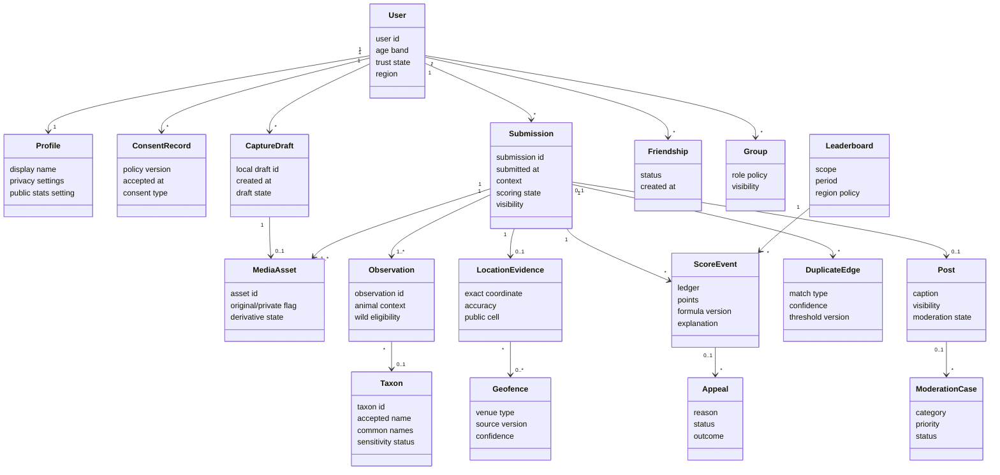

# 03 Domain Model

## Conceptual Model

This is a conceptual vocabulary model, not software classes and not database schema.

## Concept List

| Concept | Meaning | Key Attributes |
|---|---|---|
| User | Account holder recognized by the product. | user id, age band, trust state, region. |
| Profile | User-facing identity and privacy display. | display name, avatar reference, public stats setting. |
| ConsentRecord | Proof that user accepted policy terms. | policy version, timestamp, type. |
| CaptureDraft | Local pre-submission capture. | draft id, device state, local metadata. |
| MediaAsset | Original, derivative, crop, or moderation media. | asset id, storage class, visibility, processing state. |
| Submission | User-submitted capture context. | context, timestamp, visibility, scoring state. |
| Observation | Animal observation within a submission. | primary/secondary, animal context, wild eligibility. |
| Taxon | Animal taxonomy concept. | external id, accepted name, aliases, sensitivity. |
| LocationEvidence | Private exact and derived public location data. | coordinate, accuracy, cell, transform version. |
| Geofence | Zoo, sanctuary, captive venue, or policy region. | geometry, source, venue type, version. |
| ScoreEvent | Immutable scoring ledger event. | ledger, points, formula version, explanation. |
| DuplicateEdge | Relationship between related/reused submissions. | source, target, match type, confidence. |
| Post | Social display wrapper for a submission. | caption, visibility, moderation state. |
| Friendship | Relationship enabling friend visibility and ranks. | status, initiator, accepted at. |
| Group | Social collection of users and posts. | owner, roles, visibility. |
| ModerationCase | Review object for content/user/score/report. | category, priority, status, action. |
| Appeal | User challenge of a scoring/moderation decision. | reason, status, outcome. |
| Leaderboard | Score projection by scope and period. | scope, region, period, snapshot time. |

## Association Rules

- A submission may have multiple observations, but one primary observation drives score display.
- A post wraps a submission only if visibility allows publishing.
- Score events never mutate; reversals are new score events.
- Duplicate edges relate submissions without deleting either submission.
- Exact coordinates belong to restricted location evidence; public map cells are derived.
- Moderation cases can affect posts, users, submissions, score events, groups, or comments.
