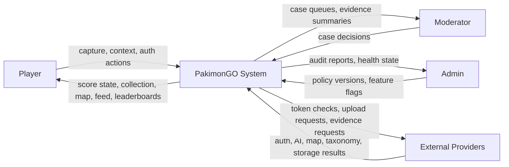
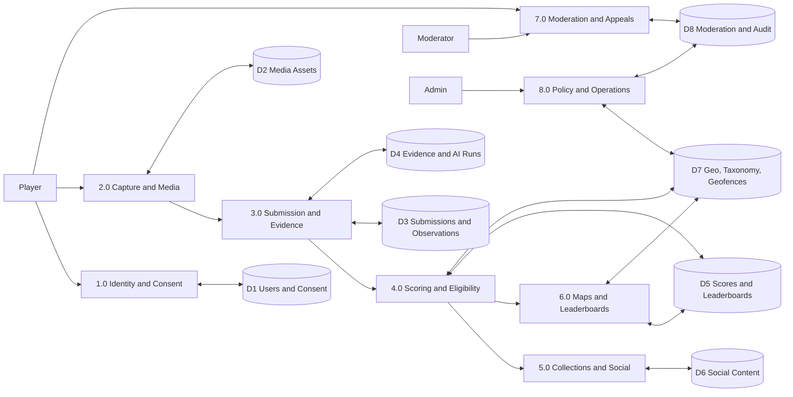
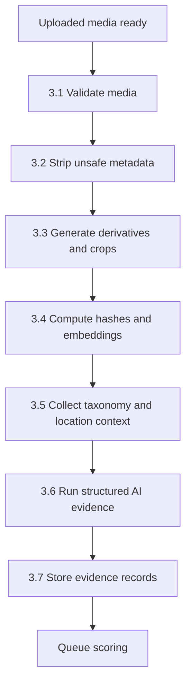
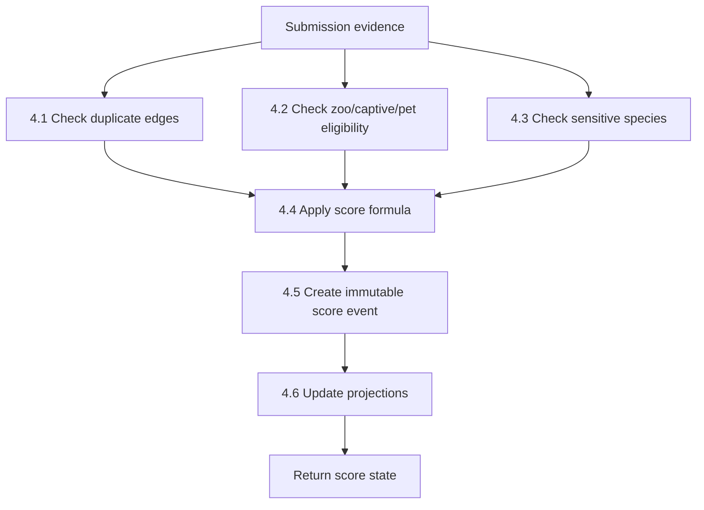

# 04 Data Flow Diagrams

## Level 0 Context Diagram



## Level 1 Processes And Data Stores



## Level 2: 3.0 Submission And Evidence



## Level 2: 4.0 Scoring And Eligibility



## Functional Hierarchy

```txt
PakimonGO
  1.0 Identity and Consent
  2.0 Capture and Media
  3.0 Submission and Evidence
    3.1 Validate media
    3.2 Strip unsafe metadata
    3.3 Generate derivatives and crops
    3.4 Compute hashes and embeddings
    3.5 Collect taxonomy and location context
    3.6 Run structured AI evidence
    3.7 Store evidence records
  4.0 Scoring and Eligibility
    4.1 Duplicate checks
    4.2 Zoo/captive/pet checks
    4.3 Sensitive species checks
    4.4 Score formula
    4.5 Score event
    4.6 Projection update
  5.0 Collections and Social
  6.0 Maps and Leaderboards
  7.0 Moderation and Appeals
  8.0 Policy and Operations
```

## Balancing Notes

- Player capture/context inputs from Level 0 appear in Level 1 as identity, capture, submission, social, and moderation inputs.
- Provider evidence inputs from Level 0 appear in Level 1 as auth, storage, map, taxonomy, and AI provider flows.
- Moderator/admin actions from Level 0 appear in Level 1 as moderation, audit, policy, and operations flows.
