# 05 Design Class Diagram

## Planned Class Diagram

This is a design-level view for future code. It is not implementation yet.

```mermaid
classDiagram
  class AuthController {
    +signIn(provider): AuthSession
    +signOut(): void
    +requestPasswordReset(email): void
  }
  class SubmissionController {
    +requestSignedUpload(command): UploadIntent
    +completeUpload(command): MediaAsset
    +submitCapture(command): Submission
    +getScoreState(id): ScoreState
  }
  class MapController {
    +getActivity(viewport): MapActivity
    +setWaypoint(command): Waypoint
  }
  class ModerationController {
    +reportContent(command): ModerationCase
    +blockUser(command): Block
    +reviewCase(command): ModerationAction
  }
  class AuthService {
    +verifyToken(token): Principal
    +linkProvider(command): Account
  }
  class MediaService {
    +createUploadIntent(command): UploadIntent
    +completeUpload(command): MediaAsset
    +createDerivatives(asset): MediaDerivatives
  }
  class SubmissionService {
    +createSubmission(command): Submission
    +markPrechecked(id): Submission
  }
  class EvidenceService {
    +extractEvidence(submission): EvidenceBundle
  }
  class ScoringService {
    +scoreSubmission(submission): ScoreEvent
    +rollbackScore(command): ScoreEvent
  }
  class GeoPrivacyService {
    +derivePublicCell(location): PublicLocationCell
    +applySensitivityRules(context): LocationPolicy
  }
  class ModerationService {
    +openCase(command): ModerationCase
    +applyAction(command): ModerationAction
  }
  class LeaderboardService {
    +projectScore(event): LeaderboardProjection
    +getLeaderboard(scope): LeaderboardPage
  }
  class AiEvidenceProvider {
    <<interface>>
    +analyzeImage(request): AiEvidence
  }
  class MapProvider {
    <<interface>>
    +getRoute(request): RouteSummary
  }
  class AuthProvider {
    <<interface>>
    +verify(token): ProviderIdentity
  }
  class SubmissionRepository {
    +save(submission): Submission
    +find(id): Submission
  }
  class ScoreEventRepository {
    +append(event): ScoreEvent
    +listForSubmission(id): ScoreEvent[]
  }

  AuthController --> AuthService
  SubmissionController --> MediaService
  SubmissionController --> SubmissionService
  SubmissionController --> ScoringService
  MapController --> GeoPrivacyService
  MapController --> MapProvider
  ModerationController --> ModerationService
  AuthService --> AuthProvider
  SubmissionService --> SubmissionRepository
  EvidenceService --> AiEvidenceProvider
  ScoringService --> ScoreEventRepository
  ScoringService --> GeoPrivacyService
  LeaderboardService --> ScoreEventRepository
```

## Principal Design Classes

| Class | Responsibility | Key Requirements |
|---|---|---|
| `AuthController` | Expose account/auth HTTP endpoints. | `FR-AUTH-*` |
| `AuthService` | Verify identity, enforce account state, link providers. | `FR-AUTH-009`, `NFR-SEC-002` |
| `SubmissionController` | Expose upload/submission/score endpoints. | `FR-CAP-*`, `FR-SCORE-*` |
| `MediaService` | Signed upload, media metadata, derivatives, EXIF handling. | `FR-CAP-011` to `FR-CAP-017` |
| `SubmissionService` | Submission state machine and context validation. | `FR-CAP-*`, `FR-SCORE-008` |
| `EvidenceService` | Hashes, embeddings, AI evidence, taxonomy hints. | `FR-DUP-*`, `FR-TAX-*` |
| `ScoringService` | Score formula, immutable events, ledgers, rollback. | `FR-SCORE-*`, `FR-LB-*` |
| `GeoPrivacyService` | Public cells, sensitivity, geofences, exact-location controls. | `FR-MAP-*`, `FR-ZOO-*` |
| `ModerationService` | Reports, blocks, appeals, actions, audits. | `FR-MOD-*`, `FR-SOC-007` |
| `LeaderboardService` | Score projections and scope queries. | `FR-LB-*` |

## Interface Boundaries

- `AuthProvider` hides Firebase provider specifics.
- `AiEvidenceProvider` hides AI provider specifics.
- `MapProvider` hides Mapbox/Google provider specifics.
- Repository interfaces hide PostgreSQL and storage details from domain logic.

## Design Constraints

- Controllers should not contain scoring formulas.
- Mobile should not bypass API/domain rules.
- Provider models should not leak into domain objects.
- Exact coordinates should not appear in public DTO classes.
- Moderation evidence access must be purpose-limited and audited.
