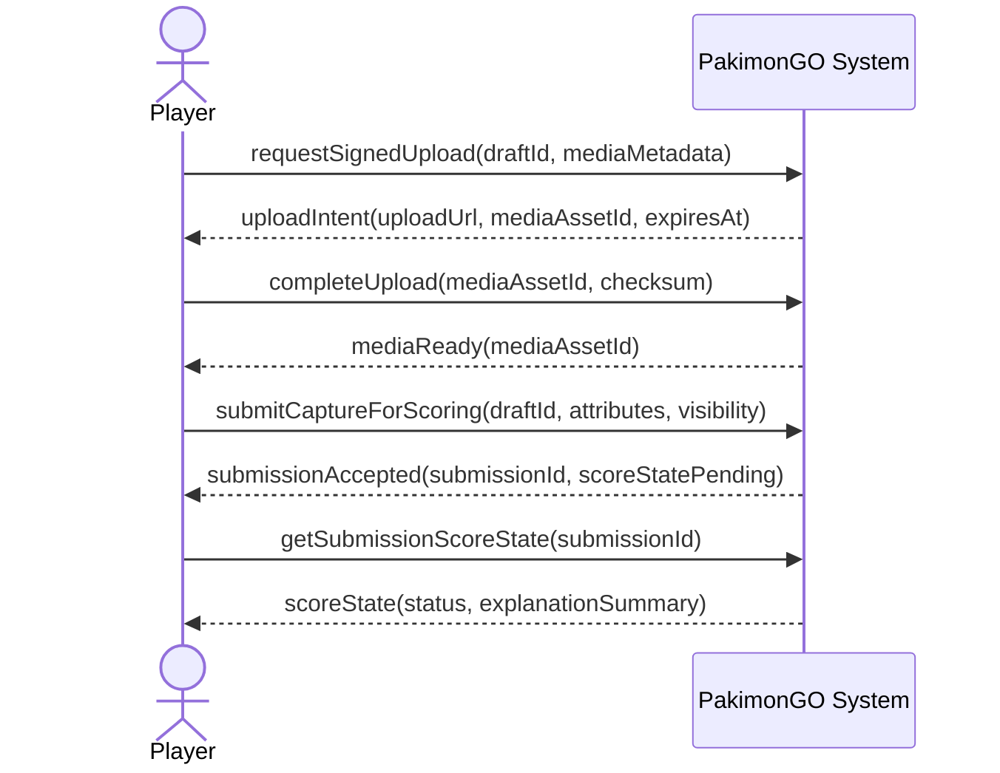
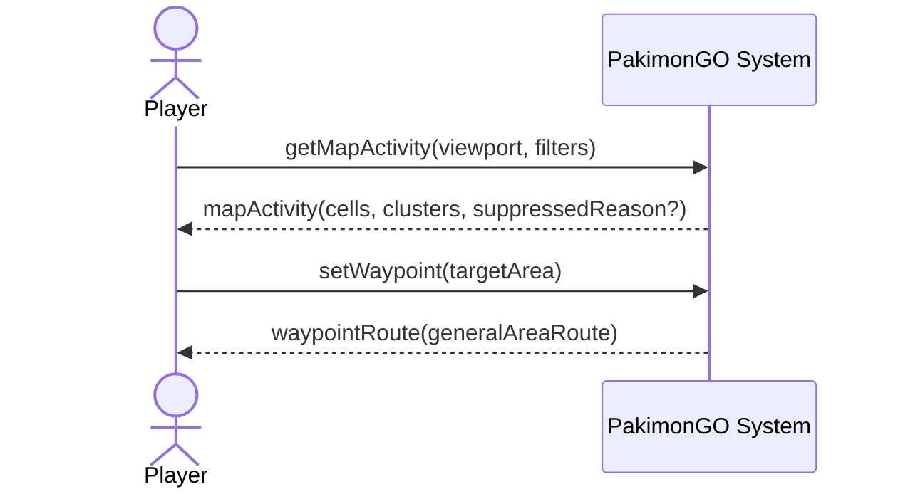
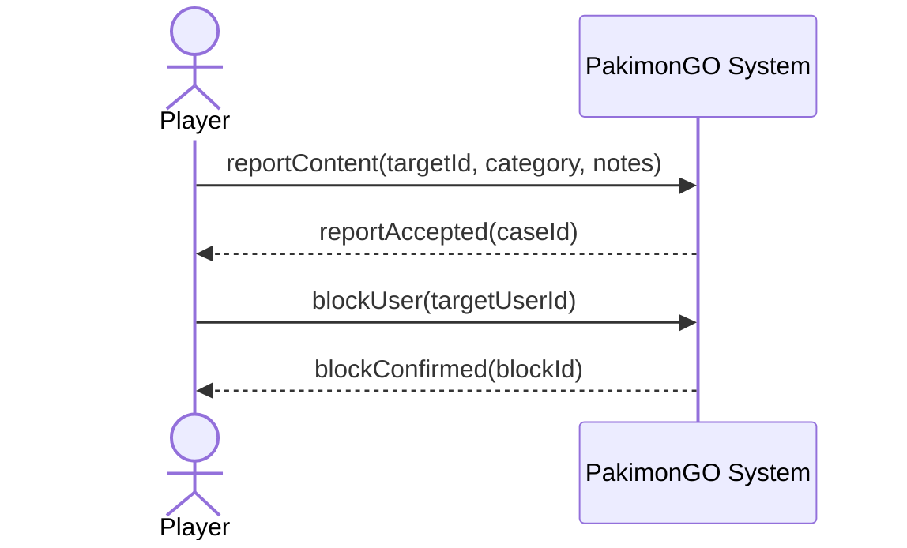
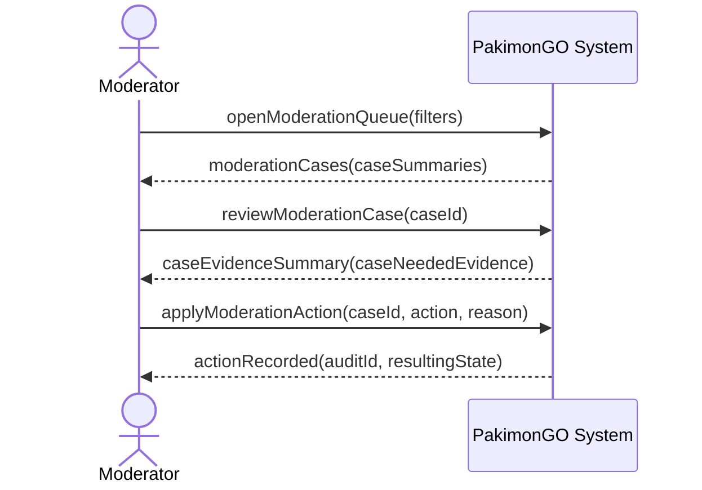

# 06 System Sequence Diagrams

## SSD: UC-004 Submit Capture For Scoring

## SSD: UC-006 Explore Map Activity

## SSD: UC-010 Report Or Block

## SSD: UC-013 Review Moderation Case

## System Operation Names

The SSD messages are the canonical operation names for contracts:

- `requestSignedUpload(draftId, mediaMetadata)`
- `completeUpload(mediaAssetId, checksum)`
- `submitCaptureForScoring(draftId, attributes, visibility)`
- `getSubmissionScoreState(submissionId)`
- `getMapActivity(viewport, filters)`
- `setWaypoint(targetArea)`
- `reportContent(targetId, category, notes)`
- `blockUser(targetUserId)`
- `openModerationQueue(filters)`
- `reviewModerationCase(caseId)`
- `applyModerationAction(caseId, action, reason)`
