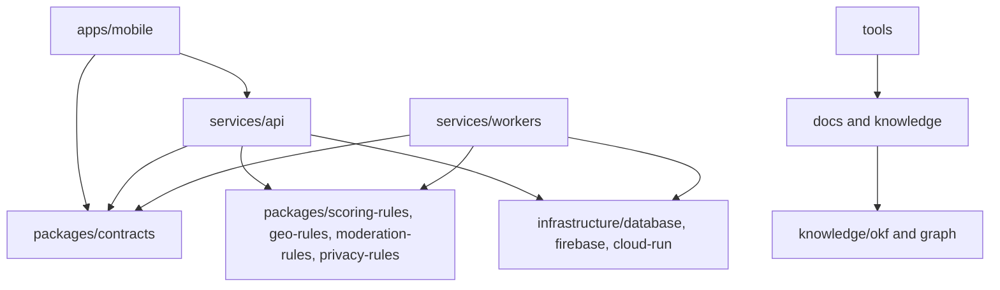

# 08 Packages And CRC

## Package Diagram

## Dependency Rule

Dependencies should flow toward contracts, pure rules, and infrastructure adapters. UI and controllers must not directly own database rules, final scoring, or privacy transformations.

## CRC Cards

| Class | Responsibilities | Collaborators |
|---|---|---|
| `AuthService` | Verify tokens, enforce account state, link providers. | `AuthProvider`, `UserRepository`, `AuditLogger`. |
| `MediaService` | Create upload intents, verify uploads, trigger media processing. | `StorageAdapter`, `MediaRepository`, `WorkerQueue`. |
| `SubmissionService` | Create submissions, validate context, manage submission state. | `SubmissionRepository`, `MediaService`, `GeoPrivacyService`. |
| `EvidenceService` | Produce hashes, embeddings, taxonomy and AI evidence. | `AiEvidenceProvider`, `TaxonomyService`, `ImageEmbeddingStore`. |
| `ScoringService` | Apply scoring formula, append score events, trigger projections. | `ScoreEventRepository`, `GeoPrivacyService`, `LeaderboardService`. |
| `GeoPrivacyService` | Derive public cells, apply geofence and sensitive species policy. | `GeofenceRepository`, `TaxonomyService`, `MapProvider`. |
| `SocialService` | Enforce visibility, posts, comments, likes, reposts, groups. | `PostRepository`, `FriendshipRepository`, `ModerationService`. |
| `ModerationService` | Open cases, apply actions, appeals, audits. | `ModerationRepository`, `AuditLogger`, `NotificationService`. |
| `LeaderboardService` | Build scope rankings from valid score events. | `ScoreEventRepository`, `RegionRepository`, `CacheAdapter`. |
| `NotificationService` | Send safe score/social/moderation notifications. | `PushProvider`, `UserSettingsRepository`. |

## Package Ownership

- `apps/mobile`: presentation, local drafts, permission UX, API clients.
- `services/api`: HTTP boundary, authorization, orchestration, public DTOs.
- `services/workers`: async processing, AI evidence, scoring jobs, projections.
- `packages/contracts`: API/event schemas and generated client/server contracts.
- `packages/scoring-rules`: pure score formula versions and tests.
- `packages/geo-rules`: privacy cells, geofence rules, sensitivity policy helpers.
- `packages/moderation-rules`: report categories and action policies.
- `packages/privacy-rules`: data classification and public/private transform rules.
- `infrastructure`: deployment, database, Firebase, Docker, Cloud Run, migrations.
