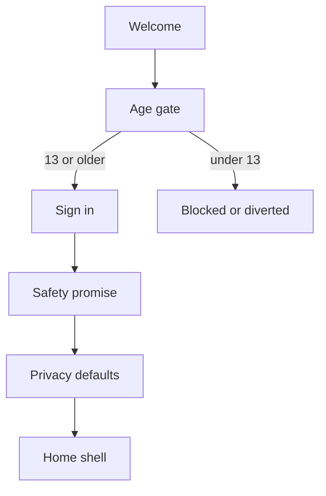
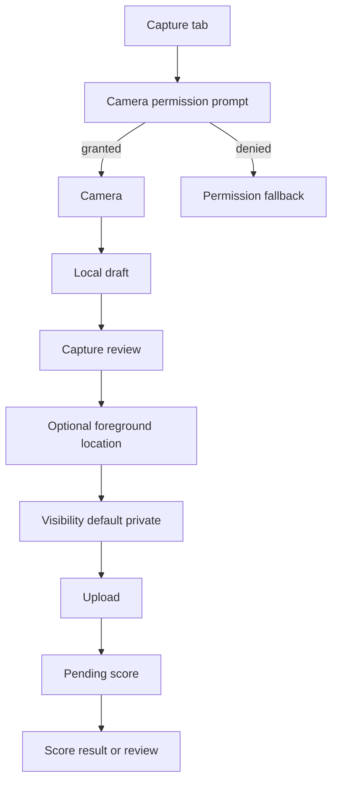
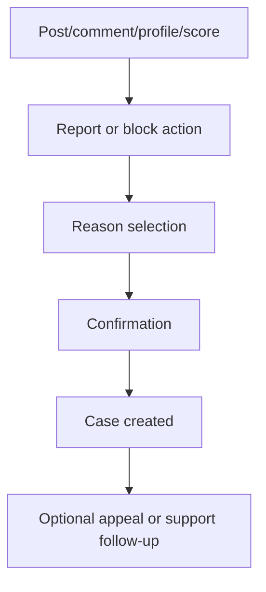

# UX Flow Specification

## Product Navigation

Primary tabs:

- Map
- Capture
- Collection
- Social
- Rank

Settings and moderation/report flows are reachable from profile, post detail, collection detail, and overflow menus.

## Flow: First Launch And Onboarding

Required states:

- under-13 blocked state
- sign-in failed
- policy update needs re-acknowledgement
- offline after onboarding

## Flow: Capture And Submit

Required states:

- no camera permission
- no location permission
- offline queued draft
- upload failed
- scoring delayed
- duplicate detected
- zoo/captive capped
- review required

## Flow: Collection

- Empty collection shows first-capture action.
- Collection cards show thumbnail, animal label, wild/pet/zoo/unknown state, score state, and visibility.
- Detail view shows score explanation summary, appeal action when allowed, privacy controls, and delete/unpublish controls.

## Flow: Map

- Map opens with player location only if foreground permission exists.
- Public animal activity appears as cells/clusters, not exact pins.
- Area sheet shows species/activity summary and safe explanation for suppressed/coarsened locations.
- Waypoint uses a general area, not exact animal coordinates.
- List fallback is available if map provider fails or accessibility requires it.

## Flow: Social

- Social features are feature-flagged.
- Private/friends selected visibility is available before public feed.
- Public comments, reposts, and groups require moderation readiness.
- Every post/comment/profile/group has report/block entry points.

## Flow: Report, Block, Appeal

## Accessibility Checklist

- No color-only score/rarity state.
- Screen-reader labels for every actionable control.
- Large text support on core flows.
- Touch targets >=44x44 platform-equivalent where practical.
- Reduced motion mode for map/game animations.
- List alternative for map activity.
- Plain-language scoring and privacy explanations.

## UX Launch Gates

- User understands zoo/pet/captive scoring before first submission.
- User understands exact locations are not public by default.
- User can complete first capture without contacts permission.
- User can recover from denied camera/location permission.
- User can report/block before any public social exposure.
